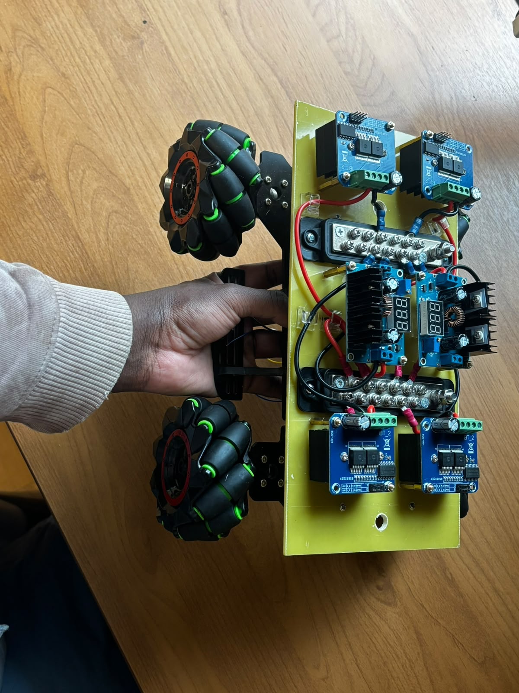

# Mecanum Wheel Mobile Robot Project

A mobile robot platform utilizing mecanum wheels for omnidirectional movement, built around the STM32 NUCLEO-F446RE microcontroller and Raspberry Pi 5, targeting full autonomous navigation with ROS 2.

## Project Overview

This project implements a mecanum wheel mobile robot capable of:
- Omnidirectional movement (forward, backward, lateral, diagonal)
- Rotation in place
- Simultaneous translation and rotation
- LiDAR-based mapping and autonomous navigation (planned)

The build follows a two-deck chassis: Deck 1 carries the power distribution layer (complete), and Deck 2 will carry the compute and sensing layer (in progress). Firmware is developed incrementally through a structured phase-based approach.

---

## Current Status

### Hardware Build

| Stage | Description | Status |
|-------|-------------|--------|
| H1 | Chassis frame assembly | ✅ Complete |
| H2 | Motor and wheel mounting | ✅ Complete |
| H3 | Deck 1 – Power wiring (bus bars, fuse, BTS7960, bucks) | ✅ Complete |
| H4 | Deck 2 – Compute and sensing layer | 🔄 In Progress |
| H5 | Full system integration and cable management | ⏳ Planned |

### Firmware (STM32 NUCLEO-F446RE)

| Phase | Description | Status |
|-------|-------------|--------|
| 1 | LED Blink – GPIO digital output | ✅ Complete |
| 2 | PWM LED Fade – Timer/PWM control | ✅ Complete |
| 3 | Single Motor Test – BTS7960 driver + one motor | ✅ Complete |
| 4 | Encoder Test – Motor encoder feedback | ⏳ Planned |
| 5 | PID Motor Control – Closed-loop velocity control | ⏳ Planned |
| 6 | UART Communication – STM32 to Raspberry Pi | ⏳ Planned |
| 7 | IMU Integration – MPU-9250 via I2C | ⏳ Planned |
| 8 | Complete Mecanum Firmware – Full 4-motor system | ⏳ Planned |

### ROS 2 (Raspberry Pi 5)

| Stage | Description | Status |
|-------|-------------|--------|
| R1 | mecanum_actions_ws – ROS 2 workspace setup | ✅ Complete |
| R2 | Velocity command interface to STM32 via UART | ⏳ Planned |
| R3 | RPLIDAR C1 integration and scan publishing | ⏳ Planned |
| R4 | SLAM (slam_toolbox) – map building | ⏳ Planned |
| R5 | Nav2 – autonomous path planning and navigation | ⏳ Planned |

---

## Build Log

### Deck 1 – Power Wiring ✅ Complete

**Goal:** Wire all power components on Deck 1 following a star topology so every consumer gets a clean, independently fused feed from the central bus bars.

**What was done:**
- Mounted 4× BTS7960 motor drivers (one per wheel: FL, FR, RL, RR)
- Mounted 2× XL4016E1 buck converters (Buck A and Buck B)
- Installed positive and negative bus bars as the central power distribution point
- Wired XT60 battery connector → inline fuse → positive bus bar
- Star-wired all BTS7960 PWR inputs and both buck converter inputs from the bus bars
- Adjusted and verified output voltages with a multimeter:
  - **Buck A → 5.10 V** (Raspberry Pi 5 supply)
  - **Buck B → 5.00 V** (STM32 Nucleo supply)

**Result:** Deck 1 power wiring complete and tested. All voltages verified. Ready for Deck 2 assembly.



---

### Deck 2 – Compute and Sensing Layer 🔄 In Progress

**Goal:** Mount and connect all compute and sensing components on Deck 2.

**Planned components:**
- Raspberry Pi 5 (compute)
- STM32 NUCLEO-F446RE (motor firmware)
- RPLIDAR C1 (360° LiDAR)
- MPU-9250 IMU (inertial measurement)
- E-stop button (safety)
- Pass-through grommets for encoder and driver logic cables from Deck 1

**Status:** Hole layout planned and drilling guide prepared. Mounting not yet started.

---

## Roadmap to Completion

The following stages run in dependency order. Hardware H4/H5 and Firmware phases 4–8 can proceed in parallel once Deck 2 is physically mounted.

| Stage | Description | Depends on |
|-------|-------------|------------|
| 1 | Deck 2 mounting (RPi 5, Nucleo, RPLIDAR, IMU) | H3 done |
| 2 | Full cable management and system integration | H4 done |
| 3 | STM32 encoder feedback + PID velocity control (FW phases 4–5) | H3 done |
| 4 | UART bridge: STM32 ↔ Raspberry Pi (FW phase 6) | Stage 3 |
| 5 | IMU integration (FW phase 7) + ROS 2 velocity command interface | Stage 4 |
| 6 | RPLIDAR integration + SLAM map building | Stage 5 |
| 7 | Nav2 autonomous navigation | Stage 6 |

---

## Hardware Components

### Compute and Control

| Component | Part | Notes |
|-----------|------|-------|
| Main compute | Raspberry Pi 5 (8 GB) | Runs ROS 2, SLAM, Nav2 |
| Microcontroller | STM32 NUCLEO-F446RE | ARM Cortex-M4, 180 MHz, 512 KB Flash |
| IMU | MPU-9250 | I2C interface |
| LiDAR | RPLIDAR C1 | 360° scanning, USB interface |

### Power System

| Component | Part | Notes |
|-----------|------|-------|
| Battery | 3S LiPo (~11.1 V nominal) | XT60 connector |
| Inline fuse | — | Battery-side protection |
| Bus bars | Positive + negative | Star topology distribution point |
| Buck A | XL4016E1 | Set to 5.10 V → Raspberry Pi 5 |
| Buck B | XL4016E1 | Set to 5.00 V → STM32 Nucleo |

### Drive System

| Component | Part | Quantity |
|-----------|------|---------|
| Motor drivers | BTS7960 | 4× (one per wheel) |
| Motors | TSINY-8370 DC with encoder | 4× |
| Wheels | Mecanum wheels | 4× |

---

## Robot Geometry

```
        Front
   FL ──────── FR
    |           |
    |  lx   lx  |
    |           |
   RL ──────── RR
        Rear
```

| Parameter | Value |
|-----------|-------|
| Wheel radius (r) | TBD – measure from assembled chassis |
| Half-wheelbase (lx) | TBD – centre-to-centre, longitudinal |
| Half-track (ly) | TBD – centre-to-centre, lateral |

Wheel naming: **FL** (front-left), **FR** (front-right), **RL** (rear-left), **RR** (rear-right).

---

## Project Structure

```
.
├── src/                    # Source code
│   ├── control/            # Motion control algorithms
│   ├── kinematics/         # Mecanum wheel kinematics
│   ├── sensors/            # Sensor integration
│   ├── communication/      # Communication protocols
│   └── utils/              # Utility functions
├── docs/                   # Documentation
│   ├── user-guide/         # User guides and development log
│   ├── videos/             # Demo videos
│   │   └── stm32/          # STM32 phase test recordings
│   └── images/             # Documentation images
│       ├── stm32/          # STM32 phase photos
│       └── hardware/       # Hardware build photos
├── hardware/               # Hardware documentation
│   ├── cad/                # CAD files and 3D models
│   ├── schematics/         # Electrical schematics
│   ├── bom/                # Bill of materials
│   └── datasheets/         # Component datasheets
├── firmware/               # Microcontroller firmware
│   └── stm32/
│       └── nucleo_f446re/
│           ├── led_blink/          # Phase 1
│           ├── pwm_led_fade/       # Phase 2
│           ├── single_motor_test/  # Phase 3
│           ├── encoder_test/       # Phase 4
│           ├── pid_motor_control/  # Phase 5
│           ├── uart_comm_test/     # Phase 6
│           ├── imu_test/           # Phase 7
│           └── mecanum_firmware/   # Phase 8 – complete system
├── config/
├── tests/
└── scripts/
```

---

## Mecanum Wheel Kinematics

The mecanum wheel configuration allows for omnidirectional movement through independent control of each wheel's velocity.

| Movement      | FL  | FR  | RL  | RR  |
|---------------|-----|-----|-----|-----|
| Forward       | +   | +   | +   | +   |
| Backward      | -   | -   | -   | -   |
| Strafe Left   | -   | +   | +   | -   |
| Strafe Right  | +   | -   | -   | +   |
| Rotate CW     | +   | -   | +   | -   |
| Rotate CCW    | -   | +   | -   | +   |

### PWM Motor Control

Each motor is controlled via a BTS7960 driver using two PWM channels:
- **RPWM**: Forward direction
- **LPWM**: Reverse direction
- **Duty cycle**: 0–999 steps (1000 resolution levels)
- **PWM frequency**: 1 kHz for development, 20 kHz for production (reduces audible noise)
- **Timer source**: APB1 at 84 MHz, prescaler 83 for 1 MHz tick, period 999 for 1 kHz output

---

## Getting Started

### Prerequisites

- [STM32CubeIDE 2.0](https://www.st.com/en/development-tools/stm32cubeide.html)
- [STM32CubeMX 6.16.1](https://www.st.com/en/development-tools/stm32cubemx.html)
- ST-LINK Server (required on macOS for flashing)
- STM32Cube FW_F4 V1.28.3 firmware package
- USB cable for ST-LINK/V2-1 on-board debugger

### Installation

1. Clone the repository:
   ```bash
   git clone https://github.com/KamalaIssack/Mecanum-wheel-mobile-robot-project.git
   ```

2. Open STM32CubeIDE and import the desired firmware project from `firmware/stm32/nucleo_f446re/`

3. Use STM32CubeMX to generate/regenerate peripheral configuration code as needed

4. Build and flash to the NUCLEO-F446RE board via the on-board ST-LINK debugger

### Development Workflow

1. Configure peripherals in STM32CubeMX (`.ioc` file)
2. Generate code (placed within `/* USER CODE BEGIN/END */` blocks to survive regeneration)
3. Build in STM32CubeIDE
4. Flash via ST-LINK

---

## Working Practices

- **Star topology**: Every power consumer connects directly to the bus bars, never daisy-chained
- **Voltage verification**: Both bucks are measured with a multimeter after any adjustment before powering compute boards
- **Battery safety**: LiPo never left unattended while charging; inline fuse is the first thing in the positive line
- **User code protection**: All STM32 application code lives inside `/* USER CODE BEGIN/END */` blocks

---

## Technical Notes

- The STM32F446RE currently uses ~1.7% Flash and ~1.3% RAM, leaving plenty of room for the full firmware
- The system will support up to 8 PWM channels (2 per motor × 4 motors)
- ROS 2 workspace: see the companion repository `mecanum_actions_ws`

For detailed firmware development notes, see [`docs/user-guide/stm32-development-log.md`](docs/user-guide/stm32-development-log.md).

---

## Contributing

1. Fork the repository
2. Create a feature branch (`git checkout -b feature/new-feature`)
3. Commit changes (`git commit -am 'Add new feature'`)
4. Push to branch (`git push origin feature/new-feature`)
5. Open a Pull Request

## License

[Add license information]

## Acknowledgments

[Add acknowledgments]
